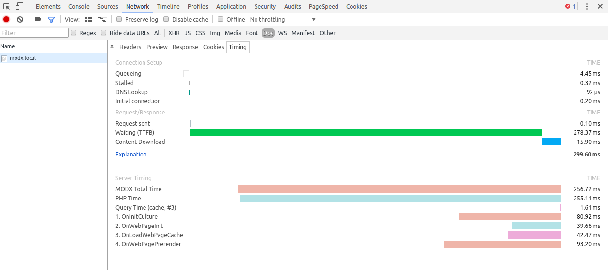

# Server-Timings

## Purpose
Plugin which sends timing data to the Chrome Developer Tools, where the data is visible in the Network/Timings tab. Inspired by a tweet from Paul Irish https://twitter.com/paul_irish/status/829090506084749312.

## Use
Create a plugin, copy the code from the file `servertimings.plugin.php` into it. Activate the following system events on the plugin:
```
OnWebPageInit
OnInitCulture
OnLoadWebPageCache
OnLoadWebDocument
OnWebPagePrerender
```

Server timings are only sent to the browser if the user is logged into the backend.

## What you will see

When you then reload your frontend page, go to your chrome's dev tools, open the network tab, click on the document resource and open the subtab Timings. There you will see the Server Timings section with our MODX information.
The following information is transferred:

* _MODX Total Time:_ the total time MODX stopped for the request/response `[^t^]`
* _Query Time ([cache|db]), #N):_ the query time, either cached or db, together with the number of executed queries `[^qt^]`, `[^s^]` and `[^q^]`
* _OnInitCulture:_ time from start of the request to the system event OnInitCulture
* _OnWebPageInit:_ time from OnInitCulture to OnWebPageInit-Event
* _OnLoadWebPageCache:_ (if cached) time from OnWebPageInit-Event to OnLoadWebPageCache
* _OnWebPagePrerender:_ (if cached) time from OnLoadWebPageCache to OnWebPagePrerender, (if uncached) time from OnWebPageInit to OnWebPagePrerender-Event

## Future enhancements
### More timings
More timings could be stopped, though not all measurable data is really useful. But with the code it is quite easy to stop _all_ event intervals by simply activating all events taking part in a frontend request let the plugin save the times. Might be interesting to see where the time is spent.

### Deeper timings
We also thought of detailed snippet/chunk timings, like they are put out with Bloodline for example. But the timing code should be very fast to not fudge the results.

### Visual
Unfortunately it is unknown how to tell the dev console how to show the event timings in consecutive timing intervals (as request are shown). If someone knows how to do this, feel free to make a PR.
